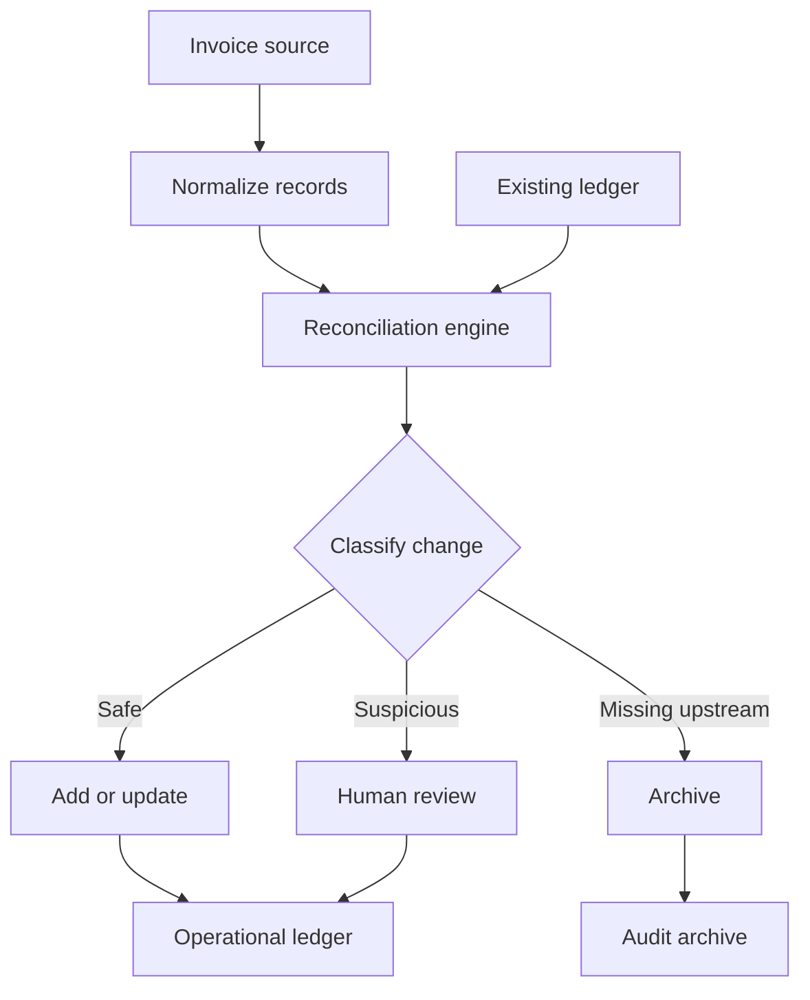

# Invoice Operations Automation

A production-inspired reconciliation pipeline that turns raw invoice data into a controlled, auditable finance workflow.

The system retrieves invoice records, normalizes them into a provider-independent model, compares them with the operational ledger, and produces an explicit sync plan. Safe changes can be applied automatically; suspicious changes are routed to human review instead of silently overwriting financial data.

> This public portfolio version uses synthetic data and generic adapters. It contains no production credentials, company records, or private API details.

## The operational problem

Invoice operations often begin as a simple export-and-copy task. At scale, the difficult questions are not how to append a row, but how to keep two systems aligned safely:

- How do we avoid duplicates when a document is fetched more than once?
- What happens when an invoice is corrected upstream?
- Should a missing source record be deleted or preserved for audit?
- How do we stop a broken API response from replacing valid financial data?
- Can scheduled automation remain understandable to the finance team?

This project treats synchronization as a reconciliation problem rather than a blind import.

## Key capabilities

- Canonical, typed invoice model independent of any vendor
- Deterministic reconciliation by stable external ID
- Add, update, archive, review, and unchanged outcomes
- Human-review routing for high-risk changes
- Configurable material-change threshold
- Explicit dry-run mode as the default
- Google Sheets destination adapter
- Synthetic JSON adapter for local demos
- Duplicate-ID validation
- Archived records retained with a reason
- Environment-based configuration and secret isolation
- Automated linting, type checking, and tests in GitHub Actions
- Example scheduled deployment workflow

## Architecture



The reconciliation engine is pure domain logic. It does not know whether records came from an API, a JSON file, or another service, and it does not write directly to Google Sheets. That separation makes the most sensitive logic easy to test and reuse.

## Review-first controls

A changed record is blocked for review when, for example:

- a populated category, business unit, or vendor becomes empty;
- a non-zero amount becomes zero;
- the amount changes beyond the configured threshold;
- the sign changes between a charge and a credit.

The engine first produces a `SyncAction` plan. The destination is mutated only when the caller explicitly selects `--apply`.

## Project structure

```text
src/invoice_ops/
  cli.py              Safe command-line entrypoint
  config.py           Validated environment configuration
  models.py           Canonical invoice domain model
  reconciliation.py   Pure diff and risk-classification logic
  json_source.py      Local/demo source adapter
  sheets.py           Google Sheets destination adapter
tests/                Reconciliation and validation tests
examples/             Synthetic invoice datasets
.github/workflows/    CI and deployment examples
```

## Quick demo

### Requirements

- Python 3.11 or later

### Install

```bash
git clone https://github.com/avivgur/invoice-operations-automation.git
cd invoice-operations-automation
python -m venv .venv
source .venv/bin/activate
pip install -e ".[dev]"
```

### Build a local reconciliation plan

```bash
invoice-ops \
  --source examples/sample_invoices.json \
  --existing examples/existing_snapshot.json
```

The demo intentionally includes:

- an unchanged invoice;
- a material amount change that is routed to review;
- a new invoice that is added;
- an old record that is archived.

No credentials or external services are required.

### Run quality checks

```bash
ruff check .
mypy
pytest
```

## Google Sheets integration

Copy the safe configuration template:

```bash
cp .env.example .env
```

Provide a spreadsheet ID and a local service-account credentials file, then share the spreadsheet with the service-account email.

```bash
invoice-ops --source path/to/invoices.json --apply
```

The `--apply` flag is deliberately required. CI credentials should be stored only as encrypted repository secrets. See [.github/workflows/daily-sync.example.yml](.github/workflows/daily-sync.example.yml) for a deployment example.

## Technology and engineering practices

| Area | Implementation |
|---|---|
| Language | Python 3.11 |
| Validation | Pydantic |
| Configuration | pydantic-settings |
| Destination | Google Sheets via gspread |
| Testing | pytest and coverage |
| Code quality | Ruff and strict mypy |
| Delivery | GitHub Actions |
| Safety | Dry-run default, review queue, archive trail, isolated secrets |

## Design decisions

### Stable IDs instead of row positions

Rows move and spreadsheets are edited manually. Reconciliation uses the source system's immutable external ID, not a row number or document title.

### Archive instead of delete

A record missing upstream is moved to an archive with a reason. This preserves traceability and makes recovery possible.

### Human judgment as part of automation

Automation should reduce repetitive work without hiding consequential decisions. Material changes are surfaced explicitly and remain visible until reviewed.

### Provider-independent core

Vendor-specific extraction belongs in an adapter. The domain model and reconciliation rules remain portable across invoice platforms, ERPs, and finance tools.

## Production extension points

A production deployment can add:

- authenticated source API adapters with token rotation;
- exchange-rate services with dated rate snapshots;
- Slack or email notifications for the review queue;
- structured logs and observability;
- idempotency checkpoints;
- approval workflows before applying reviewed changes;
- PDF or warehouse reporting adapters.

## Security

This repository contains synthetic records only. Credentials, refresh tokens, spreadsheet IDs, and production exports must never be committed. Review [SECURITY.md](SECURITY.md) before connecting an external system.

## What this project demonstrates

This project is intentionally framed as more than a data-transfer script. It demonstrates how an operational workflow can be translated into a deployable system with explicit controls, safe failure modes, auditability, and a clear boundary between automation and human approval.

Built by [Aviv Gur](https://github.com/avivgur).
